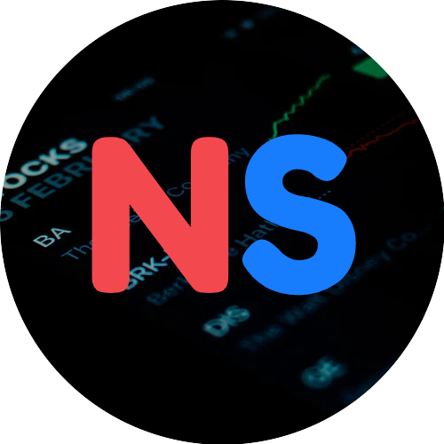
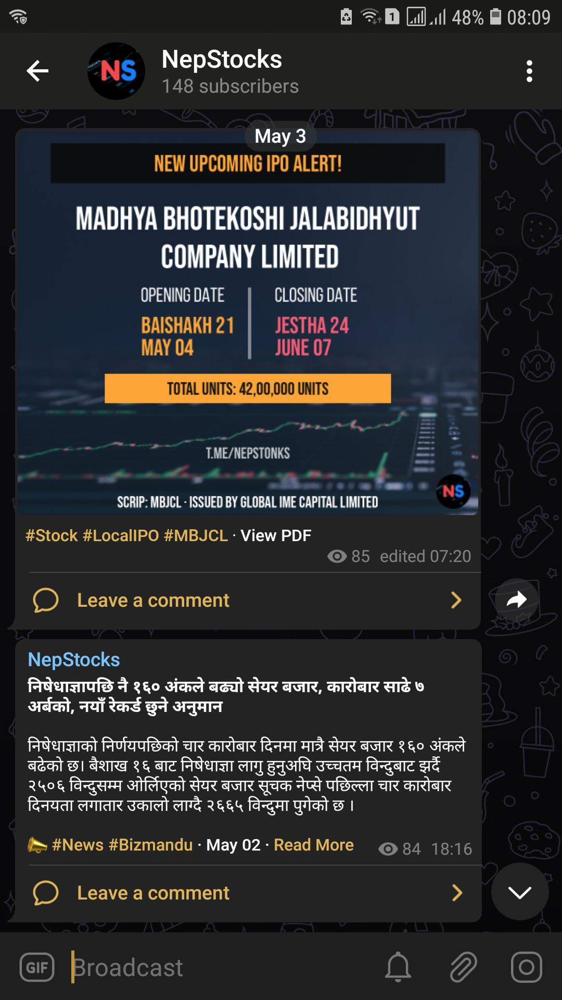
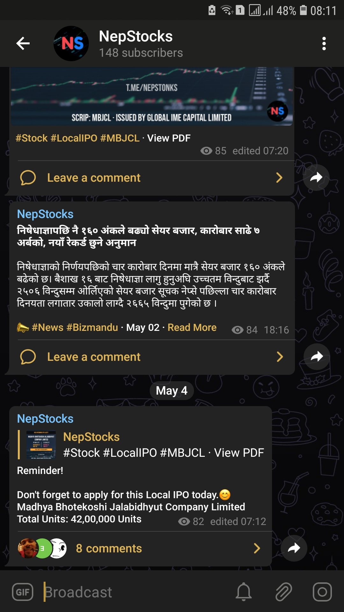

 
<strong>
A telegram channel that informs with the latest share market news, upcoming stocks, issues, and investment opportunities that are announced inside Nepal.
</strong>

### Screenshots

 

### Overview

A channel that publishes latest news & upcoming stocks related to `IPOs`, `FPOs`, `Mutual Funds`, `Right Shares` & `Debentures` and reminds to apply them. It is backed by a `telegram-bot` that does all the heavy lifting i.e. from scraping share related news from the reputed websites to updating with the latest upcoming issues. The upcoming stocks are fetched from an API and get published to this telegram channel, whereas for articles, they are scraped from multiple sources. The most important works are carried by github actions which run these workflows every day at an appointed time frame to check if there are any new issues or articles available, where I don't need to worry about deploying and cron jobs. As an automation-loving guy, I just saved myself many clicks of `sharesansar`, `bizmandu`, `merolagani` or any other similar portals we get these updates from.

### Features

- Informs about upcoming issues
- Share market and stock related news from reputed sites
- Reminds to apply for stocks beforehand

### Prerequisites

- Python 3 or higher
- Github Account
- Telegram Account
- SQLite Database

### Used Tools & Technologies

- SQLite: A database for storing stocks
- SQLAlchemy: SQL toolkit and object-relational mapper for Python
- Github Actions: CI/CD that makes it easy to automate all your software workflows

### Changelogs

- `May 02` Send stocks in Images
- `April 28` Remove merolagani updates
- `April 26` Add Reminder Notification for stocks
- `April 21` Add latest share market news

### Environment Variables

- `CHANNEL` = 'The telegram channel you want to send updates e.g @nepstonks'
- `BOT_TOKEN` = 'Bot Token generated from @botfather on telegram'
- `BOT_USERNAME` = 'Bot username generated from @botfather on telegram'
- `API_URL` = 'URL from where stocks are fetched (POST REQUEST)'
- `ORIGIN` = 'Origin needed for header when POST request is sent'
- `ORIGIN` = 'Origin needed for header from where it was referred'
- `NEWS_URL_BM` = 'The scraping link from Bizmandu'
- `PDF_URL` = 'URL that stores the uploaded PDF'

### Run & Setups

- [Install & activate virtual environment in the project root folder](https://uoa-eresearch.github.io/eresearch-cookbook/recipe/2014/11/26/python-virtual-env/)
- Add `.env` file in this folder & add all the environment variables with values given <a href="https://github.com/sidbelbase/nepstonks#environment-variables">here</a>
- Run `python -m pip install -r requirements.txt`
- Run `python app.py`

### Links

<strong><a target="_blank" href="https://t.me/nepstonks">telegram channel > t.me/nepstonks</a></strong> 

Inspired from <a target="_blank" href="https://github.com/amitness/auto-investment">auto-investment.</a>
Feel free to fork or give a star to support my doing.

### Made with ❤️ in Nepal.
